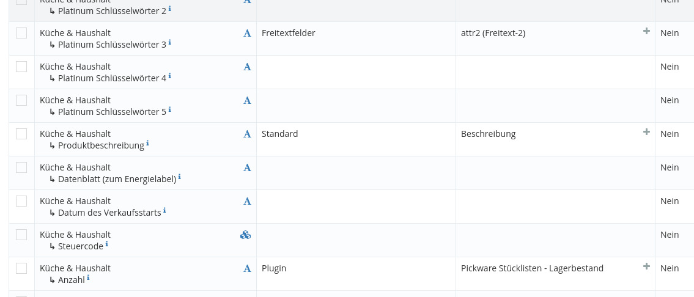

# Example for extending the Marketplace Connector

A Shopware Plugin which enables compatibility with the Sets / Stücklisten plugin.

## Open-Source

All depending classes/interfaces have also been made available open-source in the WebcuMarketplaceConnector
(Marketplace Connector Basis) Plugin.